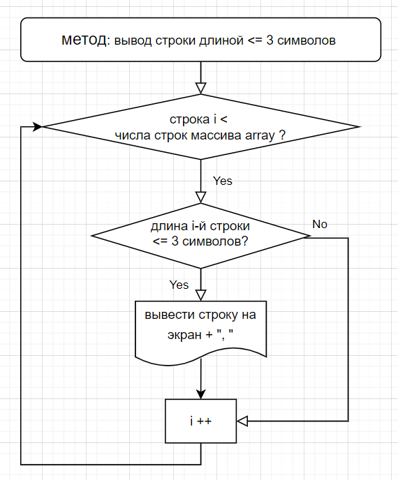

# kontrol_1_chetv
Итоговая работа по первой (вводной) четверти

**Задача:** 

написать программу, которая из имеющегося массива строк формирует массив из тех строк, которые <= 3 символов. 

**При решении:**
1. использовать массивы или методы, а не коллекции;
1. использовать все полученные в 1 четверти знания, а именно создать:

* репозиторий,

* файл ридми,

* блок-схему,

* программу для решения,

* разные ветки, слияния и коммиты в гитхабе.

**РЕШЕНИЕ**

1. на сайте app.diagrams.net создана блок-схема основного метода для решения задачи. 

1. создаем 2ю ветку, в ней пилим прогу, не забывая коммитить время от времени
1. В итоге сделали не один метод, а два. 
* Первый (string[] FillYourArray) - для ввода массива заданного размера, а 
* Второй (void NewArrayLessThan4) - непосредственно для вывода только тех элементов массива, которые не более 3 символов. Поскольку заданием не предполагается дальнейшее использование этого массива, то использован просто тип void. 
2. сливаем 2ю ветку в основную
2. Навели эстетику в коде - лишнее очистили, все перелили на гитхаб, дополнили окончательно ридми файл.
* Возможно, задание подразумевало не использовать Свойство String.Length (возможно, это относится к коллекции?), но поскольку я не планирую идти в программисты, оставляю решение таким.

**ОТЛИЧНОГО ДНЯ!**
